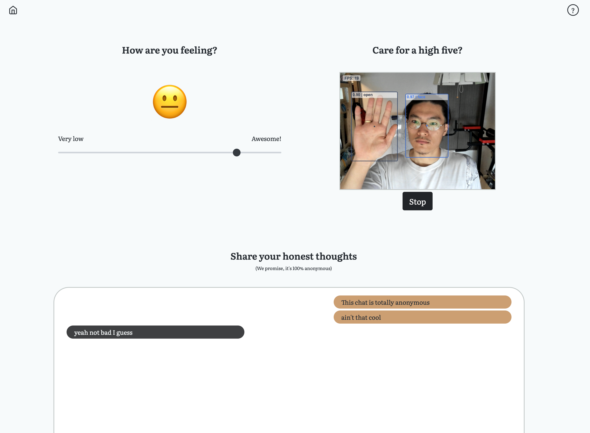

# Mood checker

[https://moodchecker.app/](https://moodchecker.app/)

Created with React, [Bootstrap](https://react-bootstrap.github.io/), [Feather icons](https://feathericons.com/), [Socket IO](https://socket.io/), [HandTrack.js](https://github.com/victordibia/handtrack.js/) and [Chart.js](https://github.com/reactchartjs/react-chartjs-2)

### Mood Slider

Allows workshop participants to constantly update their mood in realtime, which gets visualized on the facilitator dashboard anonymously.

### Remote High Five

Allows workshop participants to remotely high five each other using handtracking throught webcams.

### Anonymous chat

Allows workshop participants to post 100% anonymous chats during the workshop.
